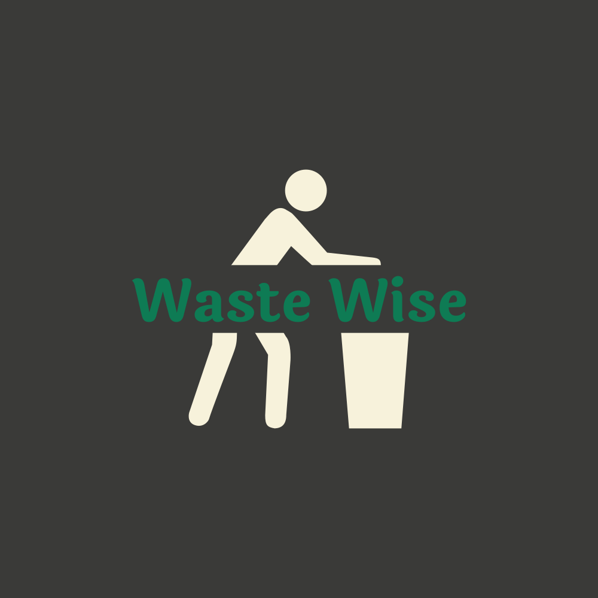

# WasteWise

<!--- 
add the WasteWise logo and align it to the center, adjust size using "width"
--->

## Brainstorm 

Hey @all! 

In this "Brainstorm" section, I just added some info collection about the requirements of the README as well as some suggestions. We need to delete this "Brainstorm" section before final hand in.

Obviously, feel free to change and beautify stuff! This is just a suggestion and just a first version.

### How to fill individual sections:
- Summary: Short project description of not more than 130 words to add to the certificate.
- How to run the demo: Explain what needs to be done for anyone to try the demo. Navigate to the corresponding WD directory, npm install, then npm run dev and so on, but explained in a better way.
- Contributors: Everyone who participated needs to add their name here. If you like, also provide a link to your GitHub profile.

## Summary 

## How to run the demo

## Contributors

### Artificial Intelligence: 
[Andrea Torcianti](https://github.com/trc729)\
[Fabian Janosch Krüger](https://github.com/fabianjkrueger)

### Data Science
[Juliana Quiroga](https://github.com/julianabquiroga)\
[Marina Zaitseva](https://github.com/zaitsevam)

### User Experience Design

### Web Development
[Andreas](https://github.com/crftwrks)
