# WasteWise

<h5 align="center">
  <a href="#artificial-intelligence">Artificial Intelligence</a> |
  <a href="#data-science">Data Science</a> |
  <a href="#user-experience-design">User Experience Design</a> |
  <a href="#web-development">Web Development</a>
</h5>

---

<!--- all tracks and names of members are sorted alphabetically --->

## Artificial Intelligence

### Members
[Andrea Torcianti](https://github.com/trc729)\
[Fabian Janosch Krüger](https://github.com/fabianjkrueger)

### Intro

Hey everyone! We are Andrea and Janosch from the AI track of this semester's TechLabs project "WasteWise". In this blog post, we will guide you through our journey and explain to you our deep learning strategy, some of the most important decisions we had to take and tell you about our experiences being part of our interdisciplinary team.

#### Our approach

Right from the start, it was rather obvious what was expected of us. WasteWise aimed to be an app allowing its users to take a photo of their waste and, based on that, receive a recommendation of how to correctly dispose of it and we would be the ones contributing the image recognition features.

Before starting to code, we needed to come up with a strategy. Together, we decided to approach our task as a single object recognition and multiclassification problem, but not to focus object detection and multiple object recognition. 

Before data acquisition, we thought about which would be the best way to compile the classes. In general, there are two options. One option was to join multiple types of objects in one class and use the type of waste bin as a label. This would have simplified data collection. Also, the outputted class could have been used as a recommendation directly. However, we decided not to follow this approach. This way, the waste objects in our classes would have been inhomogenous and the data granularity too coarse, which would have caused problems during image classification. Because of that, we took another route. We decided that each class would contain just one specific type of waste object, e.g., banana or orange peel. This way, our data had much finer granularity and an image classifier would likely perform a lot better on it. Unfortunately, however, this approach required using much more classes and the output could not be used directly as a recommendation, so the implementation of a function for translating from waste type to waste bin became necessary. For this, we planned to use a dictionary in which the classes function as keys and the recommendations are stored as values, coupled with a basic function returning the value for an inputted key.

#### Getting the data

For training the classifier on recognising waste, acquisition of sufficient image data was necessary. Together, we decided to train a first prototype capable of discriminating between 7 classes, then upscale to 20 and potentially even more than that to gradually increase complexity and performance. The classes were selected to represent common types of waste as well as rare types that many users probably do not know how to correctly dispose of. Both of this is important. If WasteWise was not able to recognize the most basic types of waste, user would get the impression that it was just a bad app. On the other hand, however, most user will likely know how to dispose of common waste types and the majority of use cases for the app will be rare and uncommon types of waste, so it is these classes, that will provide the most value to our users. 

Classes included in the 7 class prototype:
```
['apples', 
'banana_peels', 
'cardboard', 
'glass_bottle', 
'oranges', 
'plastic_packaging', 
'smartphone']
```
Additional classes included in the 20 class prototype:
```
['aluminum_foil',
 'condoms',
 'diapers',
 'food_waste',
 'old_books',
 'pans',
 'pizza_box',
 'plastic_bags',
 'plastic_toys',
 'tampons',
 'tea_bags',
 'tetrapack',
 'toothbrush']
```
There are many more classes that could have been used for this and in the future, we might implement some of them. We estimated that we needed about 30 images per class to do a first round of fine tuning. 
We downloaded the image data using the Bing and DuckDuckGo image search APIs. Both worked very well for this approach. We recommend to use DuckDuckGo, however, since it is free, while Bing is only free for a limited amount of time. One problem that came with this was that we had serious data mismatch (we found stock photos with perfect lighting etc. in the image search, but users will query the classifier on very different photos) as well as some images that did not fit the class, so we took a pre-selection. Also, we shared the data set between the two of us so to increase reproducibility and comparability between the classifiers we were about to train.

#### Architectures and frameworks

We decided to make use of transfer learning and fine tune an existing model to profit of the already high performance, to reuse resources previously invested in the training of these and to save valuable time during our project phase so we could focus on further tasks like interpretation and deployment.

From the "No Free Lunch Theorem", we know that no approach is inherently superior to all others and that to find the one suited for our problem, we need to make some assumptions and explore different architectures. In our case, we had to evaluate different CNNs. Because of this, we agreed that each one of us would train an individual classifier and that we used different frameworks for this. An Xception model would be trained using TensorFlow and a Resnet using fastai, a high level library built on top of PyTorch. After training was done, we would compare both models and select one for deployment.

### Training
As already clarified in the previous section, two different model architectures were trained and tested within the development of the Wastewise app: Xception and Resnet. Both models serve well for multiclassification problems, and Xception was especially chosen for its computationally efficient architecture.	

The 2 team members tackled the problem from different sides. On the one hand, one focused on training and comparing different versions of the Resnet architecture to investigate the effect that a growing CNN would have on the metrics for our dataset. On the other hand, the other concentrated his efforts on one individual architecture looking deeply into interpretation of the result with XAI techniques. 

The training took place similarly in both cases. Both team members scaled the models up. Initially 7 classes were included in the first prototype and then were extended to 20 classes. At the beginning of the project, we had hoped to reach upwards of 50 classes to ensure a limited but reasonable usability of the app. Unfortunately, we had to abandon the goal when we realized how much effort the data gathering would entail. We believed interpretability would represent a better learning opportunity for us than just scaling the model up.

Considering that in both cases the model had very good accuracy scores (> 98% i n the validation dataset), we will only include in the blogpost the training and result of the 20 classes prototypes. 

#### Data preparation
Both models have specific input requirements and since the training data have been web-scraped from internet, some preprocessing was necessary before feeding the images to the model.

<p align = "center">
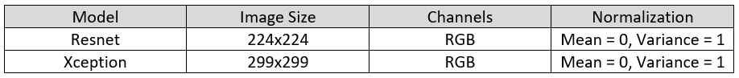
</p>

For both models the images have been properly preprocessed to ensure their optimal use.

Considering the low amount of training data (620 images for 20 classes) no data was allocated as a test set. The data were split in training and validation sets with an 80/20 split. Given that two different frameworks were deployed (tensorflow and fastai), we realized that the splits resulted in different datasets. We understand this problem affects the direct comparability of the architectures, but unfortunately we were not able to ensure a consistent split within the different frameworks.

#### Pretraining considerations
Since both architectures have proven to be quite strong with much more complex tasks (e.g. Imagenet dataset, with 20.000 classes), we assumed the trained activation maps to be sufficiently complex to achieve the desired goal of 20 classes. For this reason we planned to perform a fine-tuning of the last layer only, while freezing the rest of the network. 

#### Training Xception
After having preprocessed the data, we prepared the model. We chose to load  the Xception model with the Imagenet weights, as the Imagenet dataset shares common classes with the classes we wanted to train. 

<p align = "center">
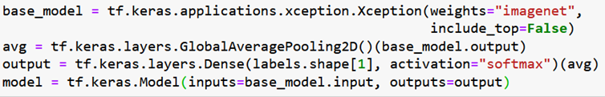
</p>

The average pooling layer was introduced before the dense layer in order to limit the output of the Xception model, since its feature vector output is very large. This measure was taken to prevent overfitting.

Since we have a multiclassification problem, we used categorical cross-entropy as a loss function and accuracy as a metric. Given its adaptivity of the learning rate and efficiency, ADAM was chosen as optimizer for the gradient descent. 

Now only one parameter needed to be determined: the learning rate. This hyperparameter is essential for the successful training of any DL model. According to the paper “Cyclical Learning Rates for Training Neural Networks” by Leslie Smith, we applied a method (lr_finder) to find the optimal learning rate for our model. After 50 epochs this is the result.

<p align = "center">
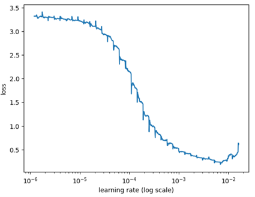
</p>

The optimal learning rate is found at the point of steepest decline of the loss. This should be about 0.0005 and this value was used for training.

In the initial iterations of the training, contrary to what the previous prototypes (3 and 7 classes classifiers) were showing, we started noticing an overfitting of the models. We reached that conclusion by observing the progression of the training: after only 5 epochs the validation loss started stagnating, while the training loss kept decreasing till the end of the training (8th epoch). As a result, we had a discrepancy in training/validation of about 11% (99% in training, 88% in validation). 

To combat the overfitting, a drop-out layer and l2 regularization were added to the model.

<p align = "center">
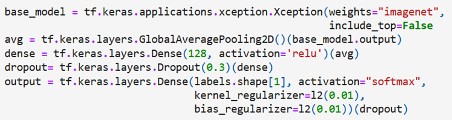
</p>

This yielded a positive effect, as the validation accuracy increased to ca. 93 %. However, some overfitting was still present. At this point, other techniques as e.g., different data augmentation and early stopping could have been applied, we decided against that as we suspected that the biggest issues was the scarce quality of the dataset and not the architecture of the model. Instead, we opted for investigating the misclassified images and classes, which we will discuss more in detail in the interpretation section.  

#### Training Resnet

The Resnet was trained using the fastai library's function "vision_learner", which automatically sests up the vast majority of parameters. We decided to take advantage of the simplicity and convenience of this function by training and evaluating several different Resnet models with different numbers of layers and selecting the one showing best performance.

The following Resnet versions can be chosen from and passed to the fastai vision learner using the "arch" argument: 
`resnet18, resnet34, resnet50, resnet101, resnet152`

The goal was to keep number of layers rather low to allow for quick execution and avoid extensive computation once the model is deployed as well as overfitting due to model complexity, while at the same time ensuring high accuracy.

In the following, the setup and procedure is described in general for all version, while the figure only shows the results for the final version.

For the first prototype trained on 7 classes, the default learning rate was used. For the upscaled version trained on 20 classes, a learning rate finder was used to determine the optimum learning rate.

<p align = "center">
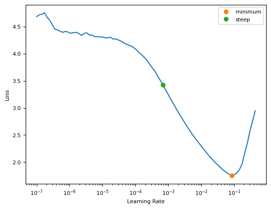
</p>

Training was done for more epochs than we expect to need to see the point at which training loss decreases while validation loss converges. This was interpreted as the point at which the model starts to overfit and for training the final model, the number of epochs was adapted to prevent overfitting.

Error rate was used as metric and cross entropy loss was used as loss function.

Finally the Resnet101 was selected and trained for 5 epochs. It showed the best performance measured by error rate (= 0.0645 -> accuracy = 0.9355) and this was already reached after training for 5 epochs. After training for longer, validation loss started to converge slowly, while training loss still continued to decrease for a while and converged much later. This is a sign of overfitting.

In deployment, 101 layers took more time per inference query than a smaller network, but even using a CPU it still was reasonably fast and took about 0.4 seconds for classifying one image.

One drawback, however, was its size. With 101 layers it needed 170 MB of memory, while the first prototype with 18 layers only needed 50 MB of memory.

### Interpretation

#### Interpretation Xception
Considering that we have web-scraped all the training images, it seems reasonable to assume that part of the overfitting is due to the poor quality of the data. First, we produce a confusion matrix to see which classes seem to be the most problematic to classify.

<p align = "center">
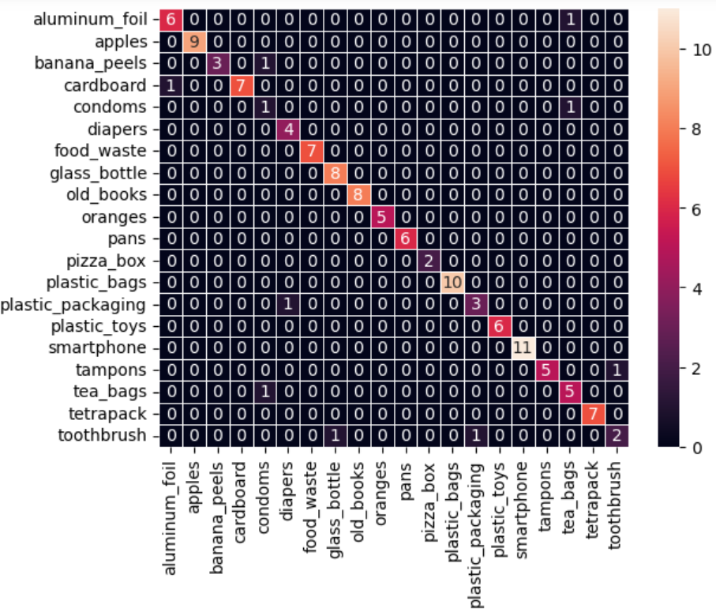
</p>

9 images out of 124 are misclassified. The most problematic class seems to be the "toothbrush" class in which 2 out 4 are not classified correctly. Upon inspection, for some images, reasonable assumptions about the misclassifications can be made. For others, it is definitely less clear. In this blog, we´ll show only considerations about 2 images, but the methods outlined can and should be applied to all the misclassified images to better understand how to improve the model.

Let´s take this image of a toothbrush which was classified with a probability of 52% as a glass bottle. 

<p align = "center">

</p>

The bottle neck shape and transparency of the object make it rather clear why the model made an error. More images of toothbrushes in the training data set should handle the missing variance and ensure that such errors won´t occur again in the future.

This image of plastic packaging was classified as diapers with a probability of about 34%. The probability is low, meaning that the model was not really confident, but it is still worth investigating as the diapers classification is surely peculiar. 

<p align = "center">
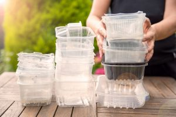
</p>

To investigate predictions of neural networks there are many different algorithms. A promising one for convolutional neural network (CNN) is the Gradient-weighted Class Activation Mapping (Grad-CAM). This is a technique for visualizing and interpreting the activation maps of CNN by highlighting the regions of an input image that contribute the most to a specific output class.

This is the output:

<p align = "center">
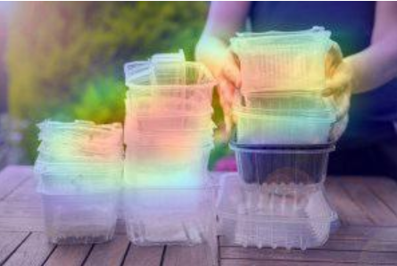
</p>

Red areas show the pixels that contributed the most to the diapers classification. Interestingly, it seems that network is focusing mostly on the plastic packaging in the picture. It appears also, it may be picking up also on the hands of the person in the photo. An inspection in the diaper class of the data revealed the presence of hands. This may be the reason for the misclassification.
But let´s see if another XAI technique can be used to corroborate our hypothesis. 
The LIME algorithm fits an explainable linear model to the CNN and uses the coefficients of the linear model to explain the predictions. The output is a segmentation (one could consider these superpixels) of the image in which the parts with the most relevant contributions are highlighted. 

<p align = "center">
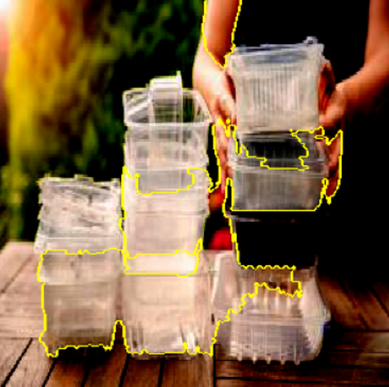
</p>

Also according to LIME, the model is picking up mostly on the plastic packaging, but also on the hands and the upper arm of person in the picture. The similarity of the packing to the diapers and the inclusion of the hands seems to be the likely cause of the misclassification. To solve this problem, the picture of diapers should be filtered of any containing hands.

#### Interpretation Resnet

Generally speaking, the model performed rather well on the validation set and, as for the Xception model, there are reasons to assume the majority of issues resulted from poor data quality.

<p align = "center">
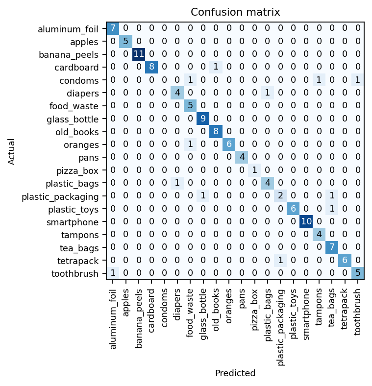
</p>

The data set was compiled from image search results and contained mostly stock photos instead of realistic images of waste a user would take.
For example, the class "oranges" shows perfect oranges and "plastic_packaging", often shows a large pile of trash instead of single objects. A good example of this is an image of a condom falsely classified for plastic packaging, because it still wrapped and not used yet. Strictly speaking, the classification was not even incorrect, since there is in fact plastic packaging in the image. A realistic user image of a condom would look pretty different from this. If we had sufficient data for training, it would be less likely that mistakes like this happened.

<p align = "center">
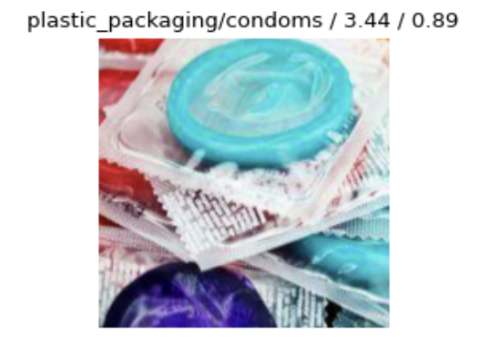
</p>

In addition to that, there are two types of problems that likely arise from bad class compilation. 
First, the classifier had trouble with classes that contained a lot of inhomogenous objects within one class, e.g., "plastic_toys" or "food_waste". We suspect that the data granularity was too coarse and the differences between the objects contained in the images have been to large for the classifier to be sufficiently trained on just 30 images.
We propose to split these classes into more smaller ones, so the classifier can be trained to be more specific. This also demonstrates, that the other one of our two initial ideas, choosing the waste bin as label, would not have worked as well. 

<p align = "center">
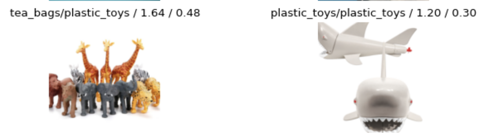
</p>

It also often mistaked classes that were very similar to another, e.g. "plastic_bags" and "aluminum_foil". 
It becomes obvious why the classifier has difficulties. On a photo, the surface of a plastic bag and of aluminum foil may have very similar reflections. In this case, we recommend training on more images and, if possible, increasing the diversity of them. If no more images are available, consider additional data augmentation. 

<p align = "center">
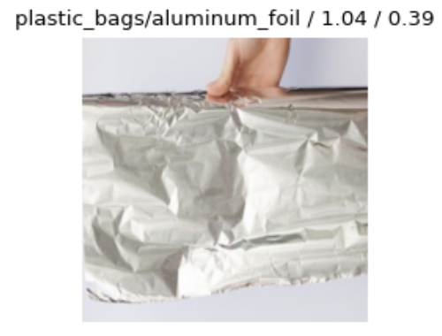
</p>

Finally, in the case of classes like paper and cardboard, that are actually physically similar to another, it might even make sense to combine them into one class, at least until there is a sufficient amount of realistic user data which can be used for training the classifiers.

The last point we want to make here is about the missing of a test set. It is absolutely crucial to include one in a proper machine learning project. Due to lack of data, we did not. During all this hyperparameter tuning, we might have overfit the validation set. In case the app is ever launched, and we were to get our hands on more user data, we would love to perform more tests and to appropriately evaluate the models.

### Data mismatch and crowdsourcing image data

We expected to witness a drop in performance once we deployed the model due to the data mismatch. As described previously, the images used for training differ strongly from what a user would query the model on. Because of that, we started an image data crowdsourcing initiative. 
Our goal was to get people to help us by taking photos of their waste and uploading it to a cloud, where it can be accessed by us. We, the members of the WasteWise team also contributed, but in order to prevent overfitting, we tried to collect as many different waste objects in as many different setups as possible. 

In order to motivate people to contribute, we put a lot of effort in our call and even made use of a meme. You can find the text and the associated meme in this directory: "wt23-wastewise/AI/DL_data_preparation".
This way, we were able to collect a little more than 100 additional images, that we would love to use in a future round of fine tuning and testing our models.

### Deployment
One of the main goals of our journey at TechLabs was to acquire and expand our knowledge about neural networks as well as to apply and consolidate it in a real world deep learning project. This included the whole process starting from laying out plans and selecting features to implement over the acquisition of data to the training and interpretation of the neural networks themselves. But of course, the other central part of our mission was to assemble all parts and finish the project phase with the production of an app that provides actual value to its users. In order to make all of this happen, we needed to work in close coordination with the rest of our team, especially the members from the web development (WebDev) track, which was an invaluable experience in its own right. Another challenge was that, while there was no lack of a frontend developer, we did not have one for the backend. Because of this, we decided to take charge of and deploy the model ourselves.

The first consideration we had to make was whether to make use of the cloud (deploy on server) or run the model on individual edge devices (include in app code and run locally). Both options are viable and come with a list of pros and contras. While deployment of the model on the cloud necessitates a network connection and adds some latency, it allows to make use of strong hardware running one version for all users that can be updated quickly if a new version of the model is made. On the other hand, running the model locally requires that the code runs natively on a multitude of different mobile devices, but enables offline use and enhanced data security. Our initial approach was to make use of edge devices, because our project mentor had some previous experience using converted TensorFlow models in Javascript. We converted the Xception model, which was trained in TensorFlow, to Tensorflow.js and, together with our WebDev, were able to load the weights inside of JavaScript. Unfortunately, however, preprocessing of the inputs in JavaScript did not work as smoothly as we had hoped initially and adapting all the code to run natively on different devices seemed like too much of a hurdle to take for us within the scope of this project phase. Because of this, we decided to switch strategy and deploy the model on a server.

<p align = "center">
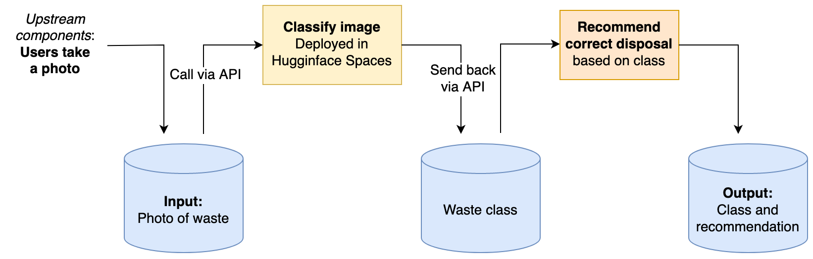
</p>

For this, we selected the Resnet model. We chose this one, since it was trained using the fastai library and thus comes with an integrated image preprocessing function. For accessing it, we created a user interface with Gradio and deployed it on Hugginface Spaces. We decided to make two versions. A minimal version which can be accessed via an API from within JavaScript that was handed over to the WebDev team for integration with the remaining parts of the app. A data frow graph of our pipeline can be seen above. The user takes a photo within the JavaScript app. This is then converted to Base64. Via an API, it is handed as input to the image classifier and the most probable class is returned. Based on this, a way of disposal is recommended using the proposed function returning the recommendation (value) from a dictionary upon passing a waste class (key).

Also, we made a __standalone version that *you* can use without downloading anything__ by just following the link posted below. This version is implemented in Python only. It allows you to use the image recognition feature, but it lacks the beautiful design and user friendlyness implemented by our WebDevs and user experience designers. It lets you take your own photos using your webcam and outputs the probabilities of the top three classes as well as a recommendation of which bin to use. 
Usage is explained at the top of the linked page and demonstrated in the GIF below. A special feature exclusively integrated in our standalone version is that a class activation map (CAM) can be added to the uploaded image. As described in the chapter about neural network training, this is a method contributing to machine learning interpretability. Parts of the image contributing to the confidence of the model during classification are marked in red. The intensity of the color is proportional to the relevance of the respetive part of the image. In the deployed version, a basic CAM algorithm is used. We also tested a Shapley-based interpretation, but this was associated with significantly longer computation. While it would have provided additional insights, we figured a user would not want to wait this long.

Finally, we would like to add some reservations before you try out WasteWise: As the deployed model currently still is just a prototype, it can only distinguish between 20 classes and still makes a lot of mistakes. The reasons for this are described in the previous chapters. In case we will be able to acquire more realistic user data in the future, we might further improve accuracy and add more classes.

<p align = "center">


#### Links to the deployed models in Huggingface Spaces:
- Standalone version: https://huggingface.co/spaces/fabianjkrueger/WasteWise
- Minimal API version for integration with the JavaScript app: https://huggingface.co/spaces/fabianjkrueger/WasteWise_API

### Conclusion
In conclusion, we can say that the goal we set for ourselves at the beginning of the project have been fulfilled. We had to overcome difficult phases, from not working code, to collaborating with different tracks, to the usual problems that such end-to-end projects entail. 

We have tried out and compared different architectures, Resnet and Xception, under different aspects. With Resnet we mostly investigated which effect an increasingly deep network has on the evaluation metrics. With Xception, on the other hand, we dove more deeply into explainability of the neural network with XAI algorithms. Both approaches reached comparably good and satisfying results (validation accuracy > 90%) on the dataset at hand. The interpretation of the misclassification led to the same conclusion: the dataset is simply not good enough to allow for a robust applicability of the models for our use-case. 

#### Outlook
So, what are the future steps if we are to make this app successful?

Two main points come into play: 
1. solving the data mismatch 
2. scalability

In order to increase the quality and confidence of our predictions we need to gather data that matches what would be the user input of our app. First, we can crowd-source further data with the program already started by one of our team members. This would allow us to both expand the classes our model can classify and to solve the data mismatch problem. Second, opening our model to grading from the user could vastly increase its capability. A a technique known as Reinforcement Learning from Human Feedback (RLHF) entails giving the users of the app the ability to grade the predictions of the model. This will enable our model to get better and better with increasing number of users. 

Concerning scalability, we estimate our model to be able to robustly classify at least 50-100 common and uncommon objects to be used in real-life scenarios. Given its proven capability, we expect Xception to tend to score better than Resnet with increasing complexity in the data set. 
However, we are confident that once the quality of our dataset reaches a satisfactory level, paired with RLHF, many available architectures will be able to satisfy our needs. 

### Personal notes
<!--- both write here --->

---

## Data Science
  
### Members
[Juliana Belen Quiroga](https://github.com/julianabquiroga)\
[Marina Zaitseva](https://github.com/zaitsevam)
  
### DATA

*Data collecting*

Together, we searched for relevant datasets and subsequently divided the workload. 

Marina took charge of three datasets, pertaining to European countries, for the time period spanning from 2000 to 2021. The datasets were obtained in their raw from the official website of the European Union (www.europa.eu):


Meanwhile, Juliana acquired raw data from 'The World Bank - Data Catalog', which provided information on the type of waste generated by each country worldwide, as well as additional details. 
Databycountry.csv

*Data Cleaning and Visualization*


Regarding Juliana’s data set, the raw data included 219 countries but after some cleaning she decided to keep only the countries with no missing values in order to not affect the visualization. In the end, the cleaned data set includes 158 countries. You can see this in the Jupyer notebook called ‘‘Bycountry_dataset’. After careful consideration, she cleaned the data to include only plastic, metal, glass, organic, paper, and other waste types for inclusion in the final dataset.

After the cleaning process was finished, Juliana created two extra notebooks for creating new csv to use for the visualization in Streamlit, you can check in tostack_continents.ipynb tostack_countries.ipynb. She created a dashboard with two interactive bar charts where users can select a country of their choice through a dropdown menu to view the percentage of each waste type. The other bar graph displays the same information, but categorized by continent. Check the code in streamlitgraph.py.

Upon completion of the cleaning process, Marina created a dashboard with 2 bar charts  to visualize changes in recycling rates and waste management in Europe over time with a dropdown menu. Marina also created an interactive bubble chart with a time-slider to see the waste, the recycling rate and the population for the selected year and country. Check the code and visualizations in Joined_data_with_visualisation_add_data.ipynb (Dash app runs inline)

In order to include as many countries as possible for the visualization,  Marina decided not to exclude countries with incomplete data (countries with absolutely no data were cleaned). This decision is crucial for understanding the visualization and machine learning implementation. Therefore, if the user does not find information on recycling rate and waste generation for a particular country in the selected year, it may be because the data is not available for that specific year. 
  
### MODEL

When we initially embarked on the project, our plan was to use an algorithm to predict user behavior over a period of three or six months, utilizing data from our app's users. However, despite numerous attempts, we were unable to achieve success due to the need to simulate data, as we did not have access to real data, and the models we tried did not prove effective. There is a folder called: Experimental_work where you can see this.

### Classification Model (not implemented)

Juliana started with creating dataset through the random function in python and afterwards making predictions to determine the type of waste generated by different age groups. We experimented with several types of models, but ultimately decided to use a decision tree.   

Marina continued to work by applying the K-Nearest Neighbors (K-NN) algorithm with K=1, which yielded 100% accuracy on the training set. Check First_attempt_ML_Evaluation.ipynb. However, this approach can lead to overfitting when dealing with noisy data. With K=2, the accuracy on the training set dropped below 70%. In real life we would consider collecting more data to improve the accuracy of the model. The cross-validation score is around 0, hence the model did not correctly classify any samples in that fold. The low accuracy on the test set is <=25%, which indicates that the model is not performing well on new data. The accuracy on the training set is 100%, which means the model is able to correctly classify all the samples in the training data, however, not perform well on new data. 

Thus, we decided to discard the current model and explore alternative models instead.

### Regression Model

We opted to utilize data sets from Europe, containing information on the recycling rate and waste production per capita by country, which allowed us to predict these values from 2022 to 2026. After analyzing our data sets with line plots (matplotlib) we agreed that linear regression might be quite suitable for the recycling rate data set, as there is a linear-like relationship between the independent and the dependent variable over time.


For the waste production data set, we have decided that a polynomial regression can be a good option to capture the wave-like pattern observed in the line plot.


### Linear Regression (Marina)

As mentioned earlier, some countries in the dataset have incomplete data that was not excluded from the analysis, unless all the data was missing. To start with a linear regression, first, the missing values in the dataset are filled with the mean value for each country (mean imputation). Then, a new dataframe for predictions (“prediction_bycountrypivot”) is created. The code then iterates through each country, selects the data for that country, and performs a linear regression on the data and makes predictions for the next five years (2022-2026). Finally, the predicted values are combined with the cleaned (original) dataset to create a final dataframe called "final_pivot" (Linear_Regression_Recycling_Final_adj.ipynb)


*Evaluation and performance of linear regression*

The R-squared, MSE and RMSE metrics provide different insights into the performance of the model. R-squared gives an indication of the goodness of fit of the model, while RMSE and MSE give an indication of the magnitude of the errors made by the model. Check the metrics  for each country in Linear_Regression_Recycling_Final_adj.ipynb. 

Below is a quick insight into regression model for some countries:


In general, the metrics show that for the countries with a lot of missing values (see the table below) the prediction is not accurate and the predictions have a larger deviation from the actual values (Albania, Iceland, Montenegro, Bulgaria, Croatia, Lithuania, United Kingdom). 


In some cases, there are countries with box plots containing a significant number of outliers (Norway and Slovakia). This has an impact on the results, indicating that alternative statistical approaches should have been considered for these countries. Lastly, when interpreting the metrics, it is important to keep in mind all decisions for data cleaning are made. In the case of Albania, 90% of data was missing and filled with the mean values, hence low RMSE is misleading, as it is based almost completely on the mean values.

As for the model itself, the mean RMSE of 10.69 indicates that the total model's predictions are off by about 10.69 units from the true values. Although the model is not perfectly accurate, it is able to make reasonably good predictions. The standard deviation of RMSE of 5.64 suggests sensitivity to the particular subset of data used to train and evaluate it.


### Polynomial Regression (Juliana)

Juliana followed the same procedure as Marina regarding the missing values that we need to fill in before we can use it for prediction. We create a new data frame called bycountrywastepivot_filled, where we fill in missing values with the mean value for each country.

We then create an empty data frame called prediction_bycountrywastepivot that we use to store our predictions.  We iterate through each country in our filled data frame and perform polynomial regression to predict waste generation for the next 5 years. We create a polynomial regression model with a degree of 2 and fit it to the data. 

We then make predictions for the years 2022 to 2026 and store these predictions in our prediction_bycountrywastepivot df.


  
*Evaluation and performance Polynomial regression*

We used R-squared values and RMSE values for each country to analyze the performance and accuracy. R-squared values indicate how well the model fits the data, with a perfect score being 1. The higher the R-squared value, the better the model fits the data. RMSE values, on the other hand, measure the difference between the predicted values and the actual values. A high RMSE value indicates that the model's predictions are inaccurate.

The R-squared values range from 0.03 to 0.94, with the highest values being for Slovakia, Spain, and Sweden. The RMSE values range from 9.08 to 81.22, with the lowest values being for Bosnia and Herzegovina and Turkey, and the highest value being for Norway.

To continue evaluating the performance, we used a pipeline, which includes two steps: polynomial feature transformation and linear regression. The degree of the polynomial used is set to 2.

To evaluate the performance of the polynomial regression model, k-fold cross-validation was used, with k=5. The cross_val_score function from scikit-learn is used to obtain the negative mean squared error (MSE) for each fold. Since we are interested in the root mean squared error (RMSE), we take the square root of the negative MSE scores and store them in the cv_rmse variable.

Finally, the mean and standard deviation of the RMSE scores are printed out. These values give an indication of the average and variability of the error in the model's predictions. In this case, the mean RMSE is 30.21, which suggests that the model's predictions are, on average, about 30.21 units away from the actual values. The standard deviation of RMSE is 7.25, indicating that there is some variability in the prediction errors across the different folds of the cross-validation.


### Visualization

We successfully visualized the predictions through two interactive maps, with a dropdown feature enabling the user to select the year, and the map being choropleth. One map represented the recycling rate data, while the other displayed waste production data.


### Conclusion

Marina's linear regression was better suited for some countries, while Juliana's polynomial regression was more effective for others. It was also noted that further analysis and alternative statistical approaches may be needed for countries with a lot of missing data or significant outliers. Due to lack of time we couldn’t evaluate other models.

Additionally, comparing the maps created from the predictions highlights interesting trends such as the variation of waste per capita production and the recycling rate by country over time. Some countries have higher waste production, as depicted by a reddish color in the map, but also have high recycling rates, which is a positive indication.


### HOSTING

### Deployment of Dash 

The Dash app displays the visualization within the Google Colab, where the code is running. The deployment of Dash with ngrok did not work out. Because of time constraints and the absence of a backend web developer in the team, the deployment process was not pursued further.


### Deployment of Streamlit

In this case the visualization was possible and Juliana managed to deploy it through the Streamlit website directly. It generates a link that was sent to the Front end developer who could add it successfully in the web app.

Link: https://julianabquiroga-streamlit-testing-streamlit-5s44p4.streamlit.app/

---

## User Experience Design
### Team
Vincent Oluwadamilare Akinyoyenu and 
Oluwayinka Ojo (NB: We both worked on every stage of this project since we are two. It was easy to work at the same time.)

#### Mentor
Sam Dewey

### Tools used
Figma, Miro, Google form, excel and docs

### Introduction
Wastewise is an innovative mobile application designed to help users sort their waste effectively and conveniently. The application is designed to offer a graphical view of waste generated by the users and predict future waste behavior. The app also provides waste information in Berlin and around the world.

### Application Design
The application was designed to provide a simple and user-friendly interface. The design team used the latest user experience design principles to create a visually appealing application that is easy to navigate. The main features of the application include the waste sorting tool, waste statistic, future prediction, and waste information.

### Work Plan
1. Research questions (Google form and excel)
2. User persona (Miro)
3. Empathy map (Miro)
4. Information architecture (Miro)
5. User flow (Miro)
6. Design system (grid, colour, font, components) and logo (Figma)
7. Low fidelity wireframe (Figma)
8. High fidelity wireframe (Figma)
9. Prototyping (Figma)
10. Usability testing (Usability hub)

### Research Questions
1. Do you sort your waste before disposing?
2. Do you understand the colour code used in waste sortation? 
3. How long do you spend sorting your waste?  
4. Can you briefly describe your current process for sorting waste before disposal?
5. What types of waste do you typically have trouble identifying how to sort properly?
6. Do you think waste sorting can reducing pollution?
7. How often do you dispose of waste in various environment (e.g. at home, at work, on the go)?
8. Have you used any tools or resources to help you sort waste in the past?
9. What would make it easier for you to properly sort waste?
10. Are there any barriers to properly sorting waste that you currently face?
11. How do you think a mobile app could help you sort waste more effectively?
12. Would you use a mobile app to help you sort waste?
13. What features or functionality would you want in a waste sorting app?

[Link to excel sheet showing all data and answers gotten from varieties of users](https://docs.google.com/spreadsheets/d/101VgcVNMlKMPHf1H1wuZ0rrmE5PHmYKxar-OOzqHInY/edit?usp=sharing)

[Miro link](https://miro.com/welcomeonboard/ZVVQRkZpSUo4b0JueHZ3dFJZR2ZZeFNGTThqSzlCZkMwY3pXVEJZaHJvczdDdmlMQW9TQU14RWZLRnBKQjFzU3wzMDc0NDU3MzU3OTgxOTMxNzEwfDI=?share_link_id=72700158089)

[Figma link](https://www.figma.com/file/M3DfeJwBaxWMzSuO5D3bZ3/WasteWise?node-id=26%3A2&t=nNC0G2r2JxWK8vxt-1)
 


[Other results can be found here](https://docs.google.com/forms/d/e/1FAIpQLSc7bfBOPOfv6cjUKSkfUpk2AImRm7yU0SJSAZ3MqB457EYqbw/viewform?usp=sharing)
 
| Value/strategic opportunity | Description | Importance 1-10 | Feasibility 1-10 |
|---|------|------|------|
|Camera scanner | Access to a camera scanner with user’s phone makes it easy to give result | 9 | 8 |
|Bin colour | The main focus of the application is to sort out waste, giving a bin colour is a good way to help users understand the necessary steps. | 10 | 9 |
|Predictions | Users will have access to how they produce waste and future predictions to help cut down waste production. | 8 | 7 |  
|Waste Information | The app can provide localised and international news  on waste based on the city or region the user wants. | 7 | 8 |

### Preparation and steps.
The first step we took in designing the application was to define the scope and goals of the project. This involves understanding the purpose and objectives of the application, as well as its target audience and market. After this, we went straight into the project phase where we conducted market research to gain insights into the industry trends, user needs, and competition. This involved researching similar applications, analyzing user feedback and reviews, and gathering data on user behaviours and preferences. We then developed user personas to help understand the needs, goals, and behaviours of the application's target audience. Our goal was to establish a clear understanding of the project goals, user needs, and market context, so that we can create a design strategy that aligns with the project's objectives and meets the user's needs.
  


The second step in designing this application was research and analysis. This step involved gathering information about the user's needs and preferences, the competition, and industry trends, to inform the design of the application.We conducted several types of research during this phase, such as:
1. User research: This involved conducting user surveys, to gain insights into the user's needs, behaviours, and pain points. User research helped us understand what the users are looking for in the application, and how they might use it in their daily lives.
2. Market research: This involves analysing the competition and industry trends, to gain insights into the market landscape and user expectations. We couldn't find any close one but we got relevant data from wikipedia and google searches. 
3. Data analysis: The data analysis team helped us with necessary data needed to understand waste in Europe. 
For the third phase, we developed a simple information architecture that revealed all the needed features for the application. From there we defined the user flows or pathways that users will follow to accomplish their tasks in the application. At first it was complex but we had to go back and adjust removing unneeded features.


### Typography
We decided on the colour, font type and style to use. We chose #0E7B54, a dark shade of green. We chose this colour because 
1. Green is often associated with environmentalism and sustainability. Using a green colour for your application can help convey its purpose and mission to users.
2. We believe the colour will add a sense of sophistication and professionalism to our application. This can help to establish trust with users and make them more likely to use the application for their waste sorting needs.
3. Green is also a calming and soothing colour, which can help to create a positive user experience. By using a darker shade of green, you can add a sense of depth and richness to your application design, while still maintaining a calming and inviting colour scheme.
Overall, #0E7B54 is a great choice for the primary colour of our waste sorting application, as it conveys a sense of environmentalism, professionalism, and calmness.
We chose roboto font type because of its easy understanding and professional usage. We created a responsive design system and components to make our task easy, professional and effective.

### Application Features
### Waste Sorting Tool:
The waste sorting tool is the main feature of the application. It is designed to help users sort their waste effectively by identifying the type of waste and providing the right bin with colour. The tool is easy to use, and users can quickly sort their waste with just a few taps on their mobile devices. The sorting tool uses machine learning and image recognition technology to identify the type of waste accurately. 
### Design: We got inspiration from how the camera and bar code works. The goal is to take a picture of the waste and the machine will determine what type of waste and suggest the right bin based on the Berlin bin colour code. We encountered a problem with this feature; what happens when the machine cannot recognise the waste? We decided to create an error screen that would lead the users back to the home page where they can type in the name of the waste and get the right bin. 

### Waste Prediction Tool
The waste prediction feature provides users with a graphical view of the waste generated by them. The feature also predicts future waste behaviour based on the user's previous waste patterns. The feature provides a detailed breakdown of the waste generated by the user, including the type of waste and the amount generated. We planned to include a feature that allows users to set goals for reducing waste and track their progress over time.
### Design: This design depends on the data science team as we need information and data from them. Not to affect the time frame of the project, we decided to create sample barchart, pie charts and maps to show how the feature should look and function. 
### Waste Information
The waste information feature provides users with information on waste in Berlin and around the world. The feature includes articles, videos, and infographics on waste management, recycling, and environmental conservation. The feature also provides users with information on the different types of waste and how to dispose of them correctly. The waste information feature is designed to educate users on the importance of proper waste management and inspire them to take action to reduce their waste footprint.
### Design: Just like the waste prediction tool, this feature leans on the data science team. We applied the same approach to create a sample graph and short information on how the feature should work and what it should look like. 

### Limitation
1. Transferring  our information to GitHub and understanding NMD and Node Js was a huge problem at first, but thanks to Fabian Janosch Krüger and Andreas who took their time to explain how Github and Node Js work and how to use them.
2. Time and communication.
### Success
1. With the awesome guidance of our mentor, we were able to finish our design before the scheduled time, and made all suggestions and corrections from our mentor. 
2. We had a sucessful user testing although documentation was diffcult and not successful, we were able to observe users use the application. 

---

## Web Development

by [crftwrks](https://github.com/crftwrks)

### Introduction

The *WasteWise* Web App was built with *React* in a *Next.js* environment. It mainly uses its own HTML/CSS components and does not depend on a CSS library. JS libraries worth mentioning are *Swiper* and *react-webcam*.

Although it’s an app primarily used with mobile devices (due to the convenience of simply taking a picture of the trash being dumped), it’s totally possible to use it on any computer with camera access. However, it is best viewed in a browser window that has been resized to fit a mobile screen in portrait mode.

---

### Tour of the app

#### Splash Screen


When the user launches the app, all they see is a screen with a logo and a claim. It fades out and goes on to the introductory tour. You can return there at any time later by clicking *Home* in the navigation bar.

Technically, this is a full viewport layer covering the *Introduction Tour* content. After its transition to transparent it’s then taken off the DOM by JavaScript.

#### Introduction Tour


As the name suggests, this tour introduces the user to the main features of the app. There are 3 slides, each representing a main function. The slides change automatically after some time, but the user is capable of swiping or clicking a navigation ‘dot’ at any time in order to go to a particular slide. Also, they can exit the tour at any time by clicking the *Get started* button. Links within the copy guide directly to the respective page, while *Get started* always directly points to the core page *Scan Waste*.

Technically, this component was built using the popular *Swiper* library, specifically its *Swiper React* version. All slides are placed side by side with only one visible in the viewport at a time. *Swiper* takes care of everything, e.g. watching the viewport dimensions, appending or removing CSS classes based on the chosen slide etc. It’s quite a flexible and huge library that felt a bit intimidating at first. But once I figured out how it builds DOM elements and how to configure it, customising and refactoring my HTML/CSS code wasn’t actually all that difficult. I still feel like I’ve only scratched the surface, but being such a powerful and popular tool I would definitely recommend it and will certainly use it in my future projects.

##### Struggle

This wasn’t about *Swiper* but about debugging my own HTML/CSS within a slide: A notable struggle was an unexpected behavior of the browser rendering the SVG inside the (column-directed) flexbox, specifically inside a flex element that is allowed to grow. My goal was to use the available space optimally: text and illustration should always be distributed harmoniously due to the different viewport sizes of mobile phone browsers, but the SVG should take up as much space as possible. It should be scaled to the maximum vertically and horizontally, but it must never be cropped. Simple, huh? Gosh! I mean, who wouldn’t just give the SVG both a `height: 0;` and `min-height: 100%;` at the same time?! 🤪 CSS is just driving me insane sometimes. Still I love it.

#### Scan Waste (and get back a result)


Scanning the waste to get instructions on where to dispose of it is undoubtedly the core feature of this app. That’s why you’ll be taken there every time you click the *Get started* button. Calling this feature will launch your camera immediately, so you can just get started. However, on the first visit, the browser asks for permission to use the camera, but once you grant it access, that’s it.

Just take a picture. After some processing time you will get a result back, which of course can also be negative: First you need to be online, your device needs to be connected to the internet. Second, the classification of the image must be successful. The result is given with a probability (*confidence*) about which object(s) the scanned thing could be. For now, I’ve added a footer that shows that confidence. If it’s below 70 %, you’ll see the *I’m not sure* screen, including the confidence rates in the 3 best guesses. Although it might not make much sense for the end user, I think it’s a nice thing since this app is a MVP still under development, also considering the limited number of items (20) it can currently identify. Depending on the percentage, the confidence is represented by the words *Possibly* (> 70 %), *Probably* (> 80 %), or *No doubt* (> 90 %). If successful, you will receive detailed descriptions of the type of waste including color code, German labels and locations of the right bins. A reset button is always available to invite you to take another picture.

Not surprisingly, programming the logic of this component was my biggest challenge in this project. What happens technically, put simply: The component receives a video stream from the camera, takes a screenshot, and the captured image is sent to a *Hugging Face* API as a Base64 encoded *data URI* – this is where the AI magic has been deployed to. For this reason, the app requires internet access. It returns an object with 3 guesses about what the scanned object might be: including each confidence about it. Based on this, the *React* component *ShowResult* puzzles together a text set from 2 different objects (waste *items* and *types*), appending a specific CSS modifier class to the DOM that is responsible for the color and way the results page is displayed. The reset button resets all *React* states in the *TakePicture* component so everything starts over.

##### Considerations regarding the camera

First of all, I did a lot of research on how to get a picture from the device’s camera. I found that there are two main approaches. A nice one is: just use an `<input>` element and add some attributes: `<input type="file" accept="image/*">` lets you select a file from your device to upload or use the camera to taking a picture, all within the common UI of your mobile phone, therefore quite intuitive. Adding `capture="camera"` will even open your camera directly. It’s easy and charming to use a ‘native’ HTML solution, but unfortunately there are some limitations. For one, you can’t customise the design of how the stream is displayed. However, as suggested by the UX team, the video stream should be displayed within a certain frame. Additionally, on a non-mobile device such as a laptop computer, this element does not cause the camera to turn on, it just suggests selecting a file from disk. So I went with the other common approach: use JS to access the camera’s video stream, display it on a canvas, and take a screenshot. This works well on all devices. I used the popular *react-webcam* library to do the main tasks.

##### Struggle

One struggle worth noting was debugging the dimensions of the captured image. While there is an option in *react-webcam* to set the width and height of the image as constraints, I’ve actually always expected to get a square image of specific dimensions to fit the design. But in one of the major browsers I might get back a different ratio, in another browser I might get back a square but in the wrong dimensions. It took me quite a while to understand what it’s about. It’s just not in my hands as a frontend developer to have full control over it as it depends on how `getUserMedia()` and the `constraints` object are handled in each browser. It may vary by version, operating system, etc. Even if you have an excellent camera, the browser may not be making the best use of it. [This project](https://webrtchacks.github.io/WebRTC-Camera-Resolution/?ref=deconstruct#bottom) gives a glimpse of it and helped me understand what it's all about. In the end I just had to accept this fact and as a workaround I just changed my CSS to show a square no matter what the ratio of the source image is. What have I learned from this? Properly reading the documentation (*react-webcam*'s in this case) could have saved me many hours...

#### Predictions


Unfortunately, the *Predictions* function could not be programmed as intended by the DS team. Therefore, all you see here is a screen telling you to hang in there.

Technically, this is a *React* component that returns static JSX/HTML code with no other function.

#### Charts


The *Charts** function shows graphical information about waste production in all countries and continents of the world.

Technically, it’s a *Streamlit* app that just loads into an iframe. As we lacked deep backend knowledge in our team, it seemed like a good way for the DS team to provide their data via *Streamlit* and thus connect it to our app. Of course, the limitations are obvious... no custom theme, no way to manipulate the DOM.

---

### Further considerations

#### Why we chose *Next.js*

For easy-to-use navigation and routing, our mentor suggested using *Next.js*. And in that regard, since we have a ‘classic’ app navigation bar at the bottom of our viewport, with icons leading to each function, *Next.js* does a really good job.

Also, since at some point in the development process it was still not clear how to connect all the different technologies from each track to our web app, and we also lacked a backend techie, *Next.js* seemed like a good foundation because it offers certain types of backend technologies.

Also considering an eventual deployment of *WasteWise* sometime in the future, *Next.js* seems like a good match, as it was mainly developed for this purpose.

---

### What’s next

There’s still a lot to improve, for example…

- Testing the app on different mobile browsers as some adjustments will likely need to be made
- Implementing a feedback function for the scanned items to train the object classifier model, e.g. two buttons *Yes, that’s correct* and *No, you are wrong*
- Adding an upload function as an alternative to using the camera
- Optimising the dimensions and file size of the image sent to the *Hugging Face* API (to reduce traffic and time)
- Debugging how the app works in *Safari* - there seem to be some strange bugs in the CSS interpretation, e.g. resulting in unwanted scrollbars in some cases
- Adding sample images of each waste bin to the output of the *ShowResult* component
- Doing some responsive adaptations to meet design needs in larger viewport sizes, e.g. for landscape mode, tablet, laptop browser…
- Adding smooth CSS transitions for hovering over links or changing what’s displayed